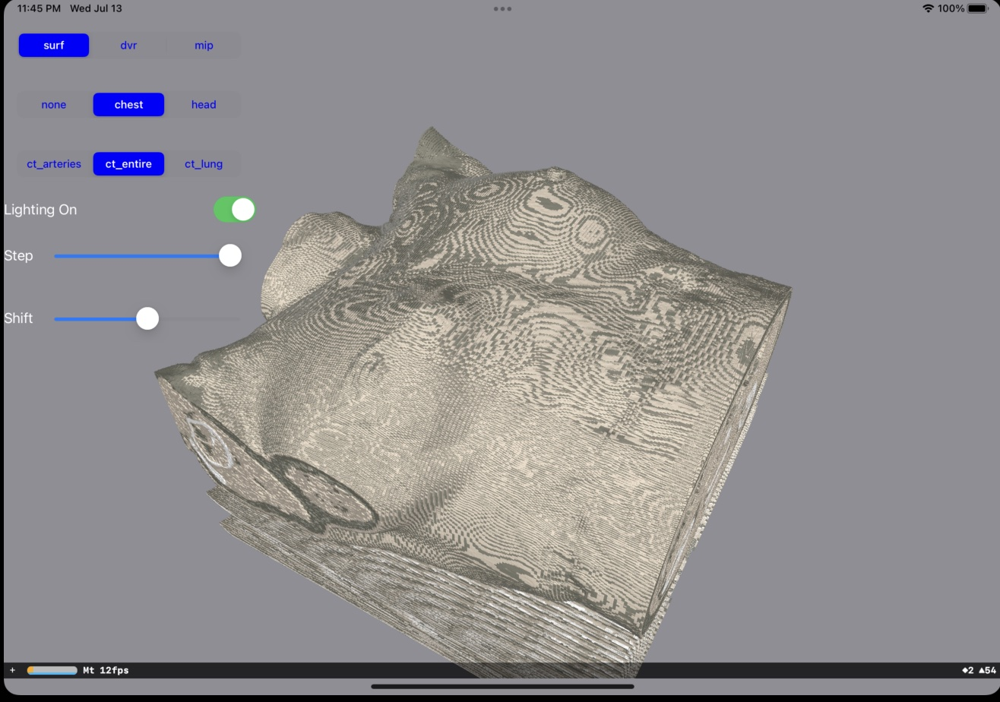
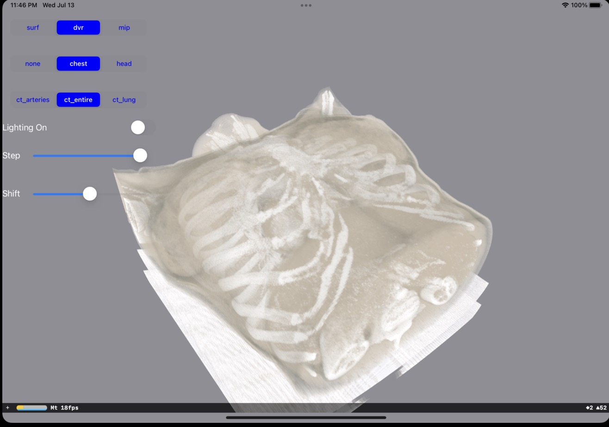
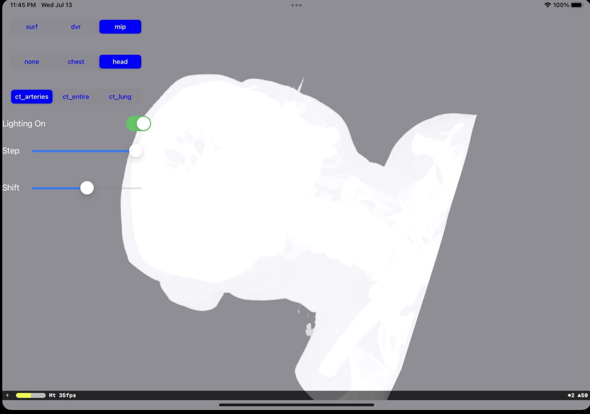
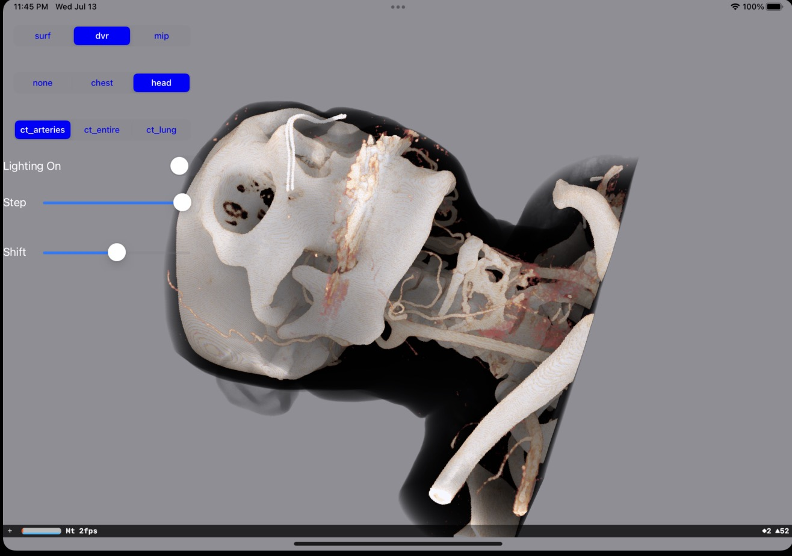
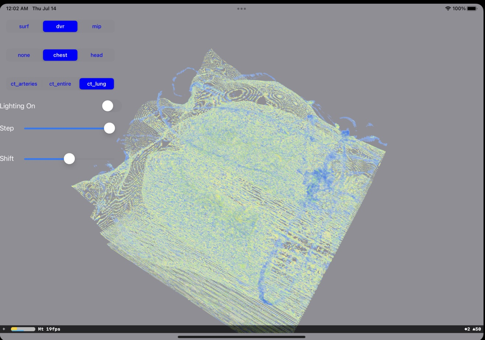
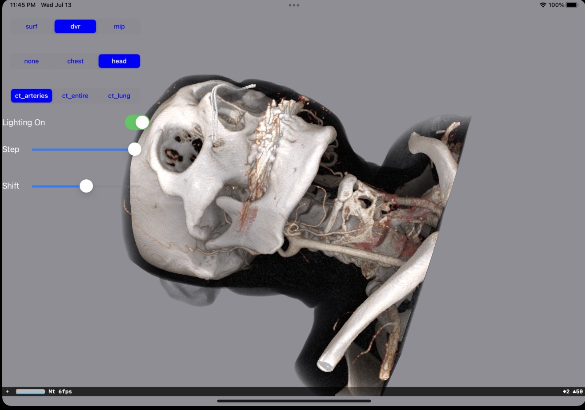

# Volume-Rendering-In-iOS
Direct and projected volume rendering on iOS using SceneKit + Metal.

### Tech
- Metal (fragment ray-marching for DVR/MIP/MinIP/AIP)
- SceneKit (scene graph and material hosting)

### Data
- Sample volumes are included in the app bundle under `VolumeRendering-iOS/Resource/Images/`
  - `chest.raw.zip` (Int16 signed LE)
  - `head.raw.zip` (Int16 signed LE)
- Transfer Functions (TF) in `VolumeRendering-iOS/Resource/TransferFunction/`
  - `ct_arteries.tf`, `ct_entire.tf`, `ct_lung.tf`

### Features
- DVR, Surface, MIP, MinIP, Average projections
- Transfer Function 1D (shared between DVR and MPR)
- Optional TF on projections (MIP/MinIP/AIP)
- HU gating for projections with configurable window
- MPR plane with optional TF
- Empty‑space skipping (conservative) for DVR

### How to run locally
1. Install Git LFS and fetch large files:
   ```bash
   brew install git-lfs
   git lfs install
   git lfs pull
   ```
2. Open the Xcode project `VolumeRendering-iOS.xcodeproj`.
3. Select a device (prefer iPhone 15 Pro Max) and run.

### Screenshots

|Surface Rendering|Direct Volume Rendering|Maximum Intensity Projection|
|-|-|-|
||||

#### Direct Volume Rendering
|CT-Coronary-Arteries|CT-Chest-Entire|CT-Lung|
|-|-|-|
||||

#### Lighting
|Lighting Off|Lighting On|
|-|-|
|||

### Licenses
- This project is based on `Unity Volume Rendering` (`mlavik1/UnityVolumeRendering`). See upstream for original license.
- New code for iOS/Metal/SceneKit is provided under the same license as this repository.

### Known issues
- Performance metrics depend on device; baseline validation targets iPhone 15 Pro Max.
- Some presets may require TF shift adjustments for best visual results.
- Large RAW datasets require Git LFS; ensure `git lfs pull` completed successfully.